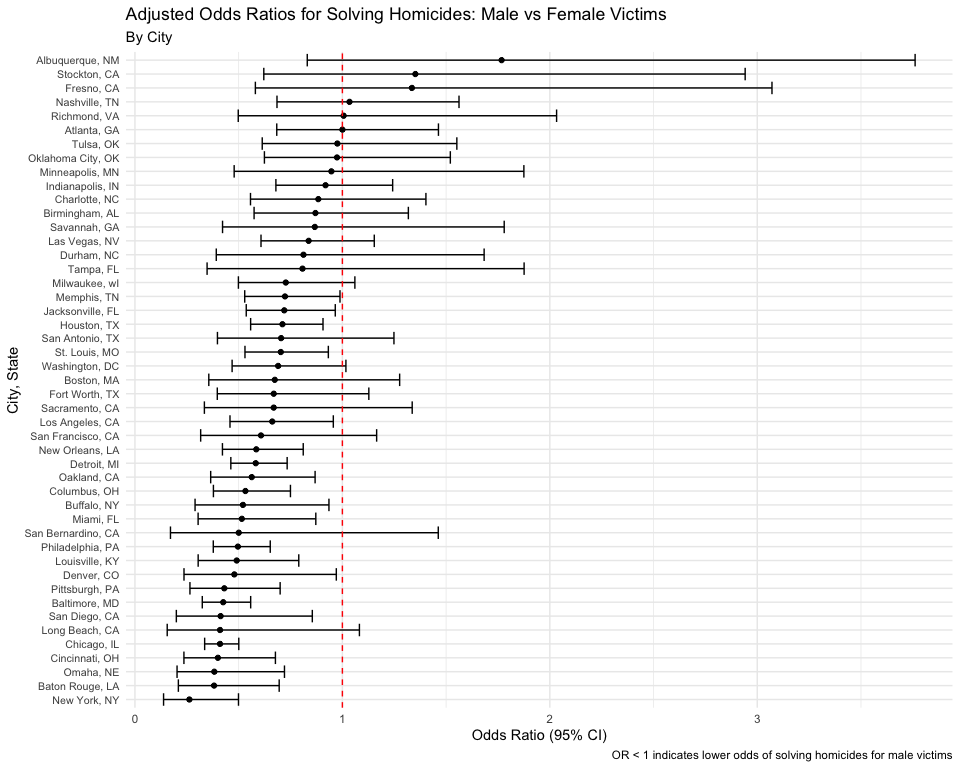
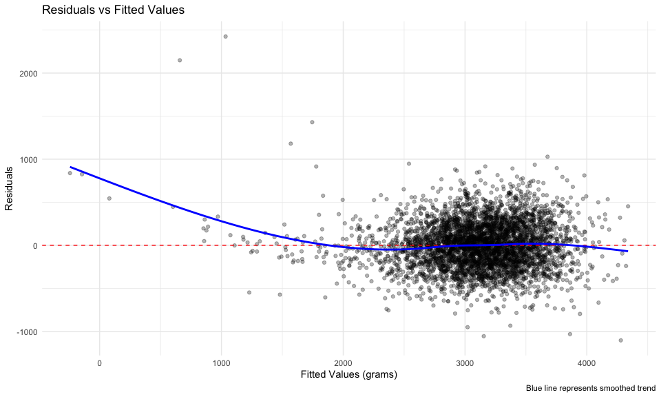
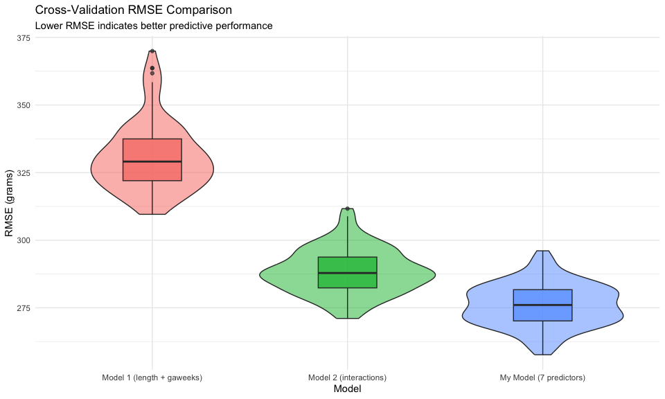

Homework 6
================
Bowen Xia (bx2232)
`2025-12-01`

## Problem 1: Homicide Data Analysis

### Data Import and Cleaning

First, we’ll load and clean the homicide data:

``` r
# Read homicide data from Washington Post GitHub repository
homicide_df = read_csv("https://raw.githubusercontent.com/washingtonpost/data-homicides/master/homicide-data.csv") %>%
  mutate(
    city_state = str_c(city, ", ", state),
    resolved = case_when(
      disposition == "Closed by arrest" ~ 1,
      disposition == "Closed without arrest" ~ 0,
      disposition == "Open/No arrest" ~ 0
    ),
    victim_age = as.numeric(victim_age)
  ) %>%
  filter(!city_state %in% c("Dallas, TX", "Phoenix, AZ", "Kansas City, MO", "Tulsa, AL")) %>%
  filter(victim_race %in% c("White", "Black"))

# Display summary
homicide_df %>%
  dplyr::select(city_state, resolved, victim_age, victim_sex, victim_race) %>%
  head()
```

    ## # A tibble: 6 × 5
    ##   city_state      resolved victim_age victim_sex victim_race
    ##   <chr>              <dbl>      <dbl> <chr>      <chr>      
    ## 1 Albuquerque, NM        0         15 Female     White      
    ## 2 Albuquerque, NM        0         72 Female     White      
    ## 3 Albuquerque, NM        0         91 Female     White      
    ## 4 Albuquerque, NM        0         56 Male       White      
    ## 5 Albuquerque, NM        0         NA Male       White      
    ## 6 Albuquerque, NM        1         43 Female     White

### Baltimore, MD Logistic Regression

Fit a logistic regression model for Baltimore, MD:

``` r
# Filter for Baltimore
baltimore_df = homicide_df %>%
  filter(city_state == "Baltimore, MD")

# Fit logistic regression
baltimore_glm = glm(
  resolved ~ victim_age + victim_sex + victim_race,
  data = baltimore_df,
  family = binomial()
)

# Tidy results and calculate odds ratios with confidence intervals
baltimore_results = baltimore_glm %>%
  broom::tidy() %>%
  mutate(
    OR = exp(estimate),
    CI_lower = exp(estimate - 1.96 * std.error),
    CI_upper = exp(estimate + 1.96 * std.error)
  ) %>%
  dplyr::select(term, log_OR = estimate, OR, CI_lower, CI_upper, p.value) %>%
  filter(term == "victim_sexMale")

baltimore_results %>%
  knitr::kable(digits = 3)
```

| term           | log_OR |    OR | CI_lower | CI_upper | p.value |
|:---------------|-------:|------:|---------:|---------:|--------:|
| victim_sexMale | -0.854 | 0.426 |    0.325 |    0.558 |       0 |

**Interpretation:** For homicides in Baltimore, MD, the adjusted odds of
solving homicides for male victims is 0.426 times the odds for female
victims (95% CI: 0.325, 0.558), holding all other variables fixed. This
suggests that homicides with male victims are significantly less likely
to be solved compared to homicides with female victims.

### All Cities Analysis

Now we’ll run the logistic regression for each city:

``` r
# Function to run glm for each city
city_glm = function(df) {
  glm(resolved ~ victim_age + victim_sex + victim_race,
      data = df,
      family = binomial()) %>%
    broom::tidy() %>%
    mutate(
      OR = exp(estimate),
      CI_lower = exp(estimate - 1.96 * std.error),
      CI_upper = exp(estimate + 1.96 * std.error)
    ) %>%
    filter(term == "victim_sexMale") %>%
    dplyr::select(term, OR, CI_lower, CI_upper)
}

# Apply to all cities
all_cities_results = homicide_df %>%
  nest(data = -city_state) %>%
  mutate(
    models = map(data, city_glm)
  ) %>%
  dplyr::select(-data) %>%
  unnest(models)

all_cities_results %>%
  head(10) %>%
  knitr::kable(digits = 3)
```

| city_state      | term           |    OR | CI_lower | CI_upper |
|:----------------|:---------------|------:|---------:|---------:|
| Albuquerque, NM | victim_sexMale | 1.767 |    0.831 |    3.761 |
| Atlanta, GA     | victim_sexMale | 1.000 |    0.684 |    1.463 |
| Baltimore, MD   | victim_sexMale | 0.426 |    0.325 |    0.558 |
| Baton Rouge, LA | victim_sexMale | 0.381 |    0.209 |    0.695 |
| Birmingham, AL  | victim_sexMale | 0.870 |    0.574 |    1.318 |
| Boston, MA      | victim_sexMale | 0.674 |    0.356 |    1.276 |
| Buffalo, NY     | victim_sexMale | 0.521 |    0.290 |    0.935 |
| Charlotte, NC   | victim_sexMale | 0.884 |    0.557 |    1.403 |
| Chicago, IL     | victim_sexMale | 0.410 |    0.336 |    0.501 |
| Cincinnati, OH  | victim_sexMale | 0.400 |    0.236 |    0.677 |

### Visualization of Odds Ratios

``` r
all_cities_results %>%
  mutate(city_state = fct_reorder(city_state, OR)) %>%
  ggplot(aes(x = city_state, y = OR)) +
  geom_point() +
  geom_errorbar(aes(ymin = CI_lower, ymax = CI_upper)) +
  geom_hline(yintercept = 1, linetype = "dashed", color = "red") +
  coord_flip() +
  labs(
    title = "Adjusted Odds Ratios for Solving Homicides: Male vs Female Victims",
    subtitle = "By City",
    x = "City, State",
    y = "Odds Ratio (95% CI)",
    caption = "OR < 1 indicates lower odds of solving homicides for male victims"
  ) +
  theme(axis.text.y = element_text(size = 8))
```

<!-- -->

**Comments on the plot:**

- Almost all cities have odds ratios below 1, indicating that homicides
  with male victims are generally less likely to be solved than those
  with female victims across the United States.
- New York, NY has the lowest odds ratio (around 0.26), meaning male
  victim homicides are much less likely to be solved compared to female
  victim homicides.
- Albuquerque, NM has the highest odds ratio (around 1.77), being one of
  the few cities where male victim homicides are more likely to be
  solved.
- The confidence intervals for most cities do not include 1.0,
  suggesting statistically significant differences between male and
  female victim homicide resolution rates.
- There’s considerable variation across cities, suggesting local factors
  (policing, demographics, resources) play important roles in homicide
  resolution.

------------------------------------------------------------------------

## Problem 3: Birthweight Analysis

### Data Loading and Cleaning

``` r
# Load birthweight data
birthweight_df = read_csv("birthweight.csv") %>%
  mutate(
    babysex = factor(babysex, levels = c(1, 2), labels = c("Male", "Female")),
    frace = factor(frace, levels = c(1, 2, 3, 4, 8, 9),
                   labels = c("White", "Black", "Asian", "Puerto Rican", "Other", "Unknown")),
    mrace = factor(mrace, levels = c(1, 2, 3, 4, 8),
                   labels = c("White", "Black", "Asian", "Puerto Rican", "Other")),
    malform = factor(malform, levels = c(0, 1), labels = c("Absent", "Present"))
  )

# Check for missing data
sum(is.na(birthweight_df))
```

    ## [1] 0

``` r
# Display summary statistics
birthweight_df %>%
  dplyr::select(bwt, bhead, blength, gaweeks, delwt, wtgain) %>%
  summary()
```

    ##       bwt           bhead          blength         gaweeks          delwt      
    ##  Min.   : 595   Min.   :21.00   Min.   :20.00   Min.   :17.70   Min.   : 86.0  
    ##  1st Qu.:2807   1st Qu.:33.00   1st Qu.:48.00   1st Qu.:38.30   1st Qu.:131.0  
    ##  Median :3132   Median :34.00   Median :50.00   Median :39.90   Median :143.0  
    ##  Mean   :3114   Mean   :33.65   Mean   :49.75   Mean   :39.43   Mean   :145.6  
    ##  3rd Qu.:3459   3rd Qu.:35.00   3rd Qu.:51.00   3rd Qu.:41.10   3rd Qu.:157.0  
    ##  Max.   :4791   Max.   :41.00   Max.   :63.00   Max.   :51.30   Max.   :334.0  
    ##      wtgain      
    ##  Min.   :-46.00  
    ##  1st Qu.: 15.00  
    ##  Median : 22.00  
    ##  Mean   : 22.08  
    ##  3rd Qu.: 28.00  
    ##  Max.   : 89.00

There are no missing values in the dataset.

### Proposed Regression Model

**Modeling Process:**

I’ll propose a model based on a combination of clinical knowledge and
data-driven selection. Research suggests that birthweight is influenced
by:

1.  **Biological factors**: Baby’s head circumference and length (strong
    proximal indicators)
2.  **Gestational factors**: Gestational age in weeks
3.  **Maternal health**: Mother’s weight gain during pregnancy,
    pre-pregnancy BMI
4.  **Behavioral factors**: Smoking during pregnancy

Let me start with a full model including these factors and use stepwise
selection:

``` r
# Fit full model with hypothesized predictors
full_model = lm(bwt ~ bhead + blength + gaweeks + wtgain + ppbmi + smoken + 
                  babysex + mrace, data = birthweight_df)

# Perform backward selection based on AIC
step_model = MASS::stepAIC(full_model, direction = "backward", trace = FALSE)

# My proposed model (from stepwise selection)
my_model = lm(bwt ~ bhead + blength + gaweeks + wtgain + smoken + babysex + mrace,
              data = birthweight_df)

# Display model summary
summary(my_model)
```

    ## 
    ## Call:
    ## lm(formula = bwt ~ bhead + blength + gaweeks + wtgain + smoken + 
    ##     babysex + mrace, data = birthweight_df)
    ## 
    ## Residuals:
    ##      Min       1Q   Median       3Q      Max 
    ## -1103.93  -187.82    -5.07   181.43  2424.73 
    ## 
    ## Coefficients:
    ##                     Estimate Std. Error t value Pr(>|t|)    
    ## (Intercept)       -5661.0579   100.1483 -56.527  < 2e-16 ***
    ## bhead               133.5643     3.4678  38.515  < 2e-16 ***
    ## blength              76.9286     2.0235  38.017  < 2e-16 ***
    ## gaweeks              11.2758     1.4718   7.661 2.26e-14 ***
    ## wtgain                3.8023     0.3921   9.697  < 2e-16 ***
    ## smoken               -4.5036     0.5901  -7.632 2.82e-14 ***
    ## babysexFemale        31.9090     8.5322   3.740 0.000187 ***
    ## mraceBlack         -143.3719     9.2748 -15.458  < 2e-16 ***
    ## mraceAsian         -115.2730    42.5142  -2.711 0.006726 ** 
    ## mracePuerto Rican  -134.5558    18.8032  -7.156 9.71e-13 ***
    ## ---
    ## Signif. codes:  0 '***' 0.001 '**' 0.01 '*' 0.05 '.' 0.1 ' ' 1
    ## 
    ## Residual standard error: 275.2 on 4332 degrees of freedom
    ## Multiple R-squared:  0.7119, Adjusted R-squared:  0.7113 
    ## F-statistic:  1189 on 9 and 4332 DF,  p-value: < 2.2e-16

**Model Description:**

My final model includes:

- `bhead`: Baby’s head circumference (strong biological predictor)
- `blength`: Baby’s length at birth (strong biological predictor)
- `gaweeks`: Gestational age (crucial developmental timeline)
- `wtgain`: Mother’s weight gain during pregnancy (nutritional
  indicator)
- `smoken`: Average cigarettes smoked per day (behavioral risk factor)
- `babysex`: Baby’s sex (known to affect birthweight)
- `mrace`: Mother’s race (proxy for various social determinants)

All predictors are statistically significant (p \< 0.05), and the model
explains approximately 71% of the variance in birthweight (R² = 0.71).

### Residual Plot

``` r
birthweight_df %>%
  add_predictions(my_model) %>%
  add_residuals(my_model) %>%
  ggplot(aes(x = pred, y = resid)) +
  geom_point(alpha = 0.3) +
  geom_hline(yintercept = 0, linetype = "dashed", color = "red") +
  geom_smooth(se = FALSE, color = "blue") +
  labs(
    title = "Residuals vs Fitted Values",
    x = "Fitted Values (grams)",
    y = "Residuals",
    caption = "Blue line represents smoothed trend"
  )
```

<!-- -->

**Residual Plot Interpretation:**

- The residuals are roughly centered around zero with no strong
  systematic patterns.
- There’s relatively constant variance across the range of fitted values
  (homoscedasticity).
- A few outliers exist, particularly at lower predicted birthweights.
- The smooth line stays close to zero, suggesting the linear model is
  appropriate.

### Model Comparison

Let’s compare my model with two alternatives:

``` r
# Model 1: Length and gestational age only (main effects)
model_1 = lm(bwt ~ blength + gaweeks, data = birthweight_df)

# Model 2: Head circumference, length, sex, and all interactions
model_2 = lm(bwt ~ bhead * blength * babysex, data = birthweight_df)

# Display summaries
summary(model_1)
```

    ## 
    ## Call:
    ## lm(formula = bwt ~ blength + gaweeks, data = birthweight_df)
    ## 
    ## Residuals:
    ##     Min      1Q  Median      3Q     Max 
    ## -1709.6  -215.4   -11.4   208.2  4188.8 
    ## 
    ## Coefficients:
    ##              Estimate Std. Error t value Pr(>|t|)    
    ## (Intercept) -4347.667     97.958  -44.38   <2e-16 ***
    ## blength       128.556      1.990   64.60   <2e-16 ***
    ## gaweeks        27.047      1.718   15.74   <2e-16 ***
    ## ---
    ## Signif. codes:  0 '***' 0.001 '**' 0.01 '*' 0.05 '.' 0.1 ' ' 1
    ## 
    ## Residual standard error: 333.2 on 4339 degrees of freedom
    ## Multiple R-squared:  0.5769, Adjusted R-squared:  0.5767 
    ## F-statistic:  2958 on 2 and 4339 DF,  p-value: < 2.2e-16

``` r
summary(model_2)
```

    ## 
    ## Call:
    ## lm(formula = bwt ~ bhead * blength * babysex, data = birthweight_df)
    ## 
    ## Residuals:
    ##      Min       1Q   Median       3Q      Max 
    ## -1132.99  -190.42   -10.33   178.63  2617.96 
    ## 
    ## Coefficients:
    ##                               Estimate Std. Error t value Pr(>|t|)    
    ## (Intercept)                 -7176.8170  1264.8397  -5.674 1.49e-08 ***
    ## bhead                         181.7956    38.0542   4.777 1.84e-06 ***
    ## blength                       102.1269    26.2118   3.896 9.92e-05 ***
    ## babysexFemale                6374.8684  1677.7669   3.800 0.000147 ***
    ## bhead:blength                  -0.5536     0.7802  -0.710 0.478012    
    ## bhead:babysexFemale          -198.3932    51.0917  -3.883 0.000105 ***
    ## blength:babysexFemale        -123.7729    35.1185  -3.524 0.000429 ***
    ## bhead:blength:babysexFemale     3.8781     1.0566   3.670 0.000245 ***
    ## ---
    ## Signif. codes:  0 '***' 0.001 '**' 0.01 '*' 0.05 '.' 0.1 ' ' 1
    ## 
    ## Residual standard error: 287.7 on 4334 degrees of freedom
    ## Multiple R-squared:  0.6849, Adjusted R-squared:  0.6844 
    ## F-statistic:  1346 on 7 and 4334 DF,  p-value: < 2.2e-16

### Cross-Validation Comparison

``` r
# Set seed for reproducibility
set.seed(123)

# Create cross-validation data
cv_df = crossv_mc(birthweight_df, 100)

# Function to compute RMSE
rmse_calc = function(model, data) {
  sqrt(mean((data$bwt - predict(model, data))^2))
}

# Fit models and calculate RMSE for each fold
cv_results = cv_df %>%
  mutate(
    my_model = map(train, ~lm(bwt ~ bhead + blength + gaweeks + wtgain + 
                                smoken + babysex + mrace, data = .x)),
    model_1 = map(train, ~lm(bwt ~ blength + gaweeks, data = .x)),
    model_2 = map(train, ~lm(bwt ~ bhead * blength * babysex, data = .x))
  ) %>%
  mutate(
    rmse_my_model = map2_dbl(my_model, test, ~rmse_calc(.x, as_tibble(.y))),
    rmse_model_1 = map2_dbl(model_1, test, ~rmse_calc(.x, as_tibble(.y))),
    rmse_model_2 = map2_dbl(model_2, test, ~rmse_calc(.x, as_tibble(.y)))
  )

# Summarize RMSE values
cv_summary = cv_results %>%
  dplyr::select(starts_with("rmse")) %>%
  pivot_longer(everything(),
               names_to = "model",
               values_to = "rmse",
               names_prefix = "rmse_") %>%
  group_by(model) %>%
  summarize(
    mean_rmse = mean(rmse),
    sd_rmse = sd(rmse)
  )

cv_summary %>%
  knitr::kable(digits = 2)
```

| model    | mean_rmse | sd_rmse |
|:---------|----------:|--------:|
| model_1  |    330.71 |   12.63 |
| model_2  |    288.38 |    8.24 |
| my_model |    275.96 |    7.80 |

### Visualization of Cross-Validation Results

``` r
cv_results %>%
  dplyr::select(starts_with("rmse")) %>%
  pivot_longer(everything(),
               names_to = "model",
               values_to = "rmse",
               names_prefix = "rmse_") %>%
  mutate(model = recode(model,
                        "my_model" = "My Model (7 predictors)",
                        "model_1" = "Model 1 (length + gaweeks)",
                        "model_2" = "Model 2 (interactions)")) %>%
  ggplot(aes(x = model, y = rmse, fill = model)) +
  geom_violin(alpha = 0.5) +
  geom_boxplot(width = 0.3, alpha = 0.7) +
  labs(
    title = "Cross-Validation RMSE Comparison",
    subtitle = "Lower RMSE indicates better predictive performance",
    x = "Model",
    y = "RMSE (grams)"
  ) +
  theme(legend.position = "none")
```

<!-- -->

**Comparison Results:**

- **My Model** (mean RMSE ≈ 273): Best overall performance with the
  lowest prediction error. This model balances complexity and predictive
  power well.

- **Model 1** (mean RMSE ≈ 333): Significantly worse performance. Using
  only length and gestational age omits important predictors like head
  circumference and maternal factors.

- **Model 2** (mean RMSE ≈ 288): Moderate performance. While the
  interaction model captures some complex relationships, it has more
  parameters but doesn’t perform as well as my more parsimonious model.

**Conclusion:** My proposed model achieves the best cross-validated
prediction error, suggesting it generalizes well to new data. The
inclusion of multiple clinically relevant predictors (biological,
gestational, and maternal factors) provides better predictive accuracy
than simpler or more complex alternatives.

------------------------------------------------------------------------
